# AWS Batch Deep Dive


[WorkShop](https://catalog.workshops.aws/aws-batch-deep-dive/en-US)をCDKで実装したもの

## ハンズオンのコンテンツ

| No  | Job                                                                                                                 | 説明                                                                                     |
| --- | ------------------------------------------------------------------------------------------------------------------- | ---------------------------------------------------------------------------------------- |
| 1   | [Single job](https://catalog.workshops.aws/aws-batch-deep-dive/en-US/05-run-batch-jobs/51-single)                   | 単一のJob実行について学ぶ。                                                              |
| 2   | [Array Job](https://catalog.workshops.aws/aws-batch-deep-dive/en-US/05-run-batch-jobs/52-array)                     | 配列Jobについて学ぶ。                                                                    |
| 3   | [Multi-node parallel Job](https://catalog.workshops.aws/aws-batch-deep-dive/en-US/05-run-batch-jobs/53-mnp)         | 複数のインスタンス上（マルチノード）で実行するジョブについて学ぶ。                       |
| 4   | [Jobs With dependencies](https://catalog.workshops.aws/aws-batch-deep-dive/en-US/05-run-batch-jobs/54-dependencies) | Job間で依存関係があるケースについて学ぶ。                                                |
| 5   | [Jobs With dependencies (EC2 Spot)](https://catalog.workshops.aws/aws-batch-deep-dive/en-US/06-ec2-spot)            | Spotインスタンスの利用方法について学ぶ。実態はNo.4の一部がSpotインスタンスになったもの。 |


## ディレクトリ構成

```sh
.
├── README.md
├── bin
│   └── workshop_batch.ts
├── cdk.json
├── docs
│   ├── array-job.drawio.svg
│   ├── dependency-job-spot.drawio.svg
│   ├── dependency-job.drawio.svg
│   ├── multi-node-parallel-job.drawio.svg
│   └── single-job.drawio.svg
├── jest.config.js
├── lib
│   ├── constructs
│   │   ├── ap  # コンテナ資材を格納
│   │   ├── ecs-ec2-batch.ts  # ECS on EC2によるAWS Batchの実装（Workshopのメイン）
│   │   ├── ecs-fargate-batch.ts  # ECS on FargateによるAWS Batchの実装（Workshopには登場しない）
│   │   └── network.ts  # ネットワーク（VPC）を定義
│   └── workshop_batch-stack.ts
├── package-lock.json
├── package.json
├── test
│   └── workshop_batch.test.ts
└── tsconfig.json

```


## 実行方法

### Single Job


```sh
export SINGLE_JOB_NAME="stress-ng-1"
export SINGLE_JOB_QUEUE="stress-ng-queue"
export SINGLE_JOB_DEFINITION="stress-ng-job-definition"
export SINGLE_STRESS_ARGS="--cpu 1 --cpu-method fft --timeout 1m --times"
aws batch submit-job --job-name "${SINGLE_JOB_NAME}" --job-queue "${SINGLE_JOB_QUEUE}" --job-definition "${SINGLE_JOB_DEFINITION}" --container-overrides "environment=[{name='STRESS_ARGS',value='${SINGLE_STRESS_ARGS}'}]"
```

### Array Job


```sh
export ARRAY_JOB_NAME="job-array-5"
export ARRAY_JOB_SIZE=5
export ARRAY_JOB_QUEUE="stress-ng-queue"
export ARRAY_JOB_DEFINITION="stress-ng-array-job-definition"
aws batch submit-job --job-name "${ARRAY_JOB_NAME}" --job-queue "${ARRAY_JOB_QUEUE}" --job-definition "${ARRAY_JOB_DEFINITION}" --array-properties size="${ARRAY_JOB_SIZE}"
```

### Multi-node Parallel Job


```sh
export MNP_JOB_NAME="mnp-1"
export MNP_JOB_QUEUE="stress-ng-queue"
export MNP_JOB_DEFINITION="mnp-job-definition"
aws batch submit-job --job-name "${MNP_JOB_NAME}" --job-queue "${MNP_JOB_QUEUE}" --job-definition "${MNP_JOB_DEFINITION}"
```

### Jobs With dependency
* Leader Job(EC2) + Follower Job(EC2)


* Leader Job(EC2) + Follower Job(EC2, Spot)


```sh
# Get Bucket Name
export STRESS_BUCKET="s3://$(aws cloudformation describe-stacks --stack-name WorkshopBatchStack --output text --query 'Stacks[0].Outputs[?OutputKey == `Bucket`].OutputValue')"
echo "${STRESS_BUCKET}"

# Leader Job
export LEADER_JOB=$(aws batch submit-job --cli-input-json '{"jobName": "stress-ng-leader", "jobQueue": "stress-ng-queue", "jobDefinition": "stress-ng-leader-job-definition", "containerOverrides": {"environment": [{"name": "STRESS_BUCKET", "value": "'"$STRESS_BUCKET"'"}]}}')
echo "${LEADER_JOB}"
export LEADER_JOB_ID=$(echo ${LEADER_JOB} | jq -r '.jobId')
echo "${LEADER_JOB_ID}"

# Follower Job
export FOLLOWER_JOB=$(aws batch submit-job --cli-input-json '{"jobName": "stress-ng-follower", "jobQueue": "stress-ng-queue", "arrayProperties": {"size": 2}, "jobDefinition": "stress-ng-follower-job-definition", "containerOverrides": {"environment": [{"name": "STRESS_BUCKET", "value": "'"$STRESS_BUCKET"'"}]}}' --depends-on jobId="${LEADER_JOB_ID}" --array-properties size=12)
export FOLLOWER_JOB_ID=$(echo ${FOLLOWER_JOB} | jq -r '.jobId')
echo "${FOLLOWER_JOB_ID}"

# Follower Job (Spot)
export FOLLOWER_JOB_SPOT=$(aws batch submit-job --cli-input-json '{"jobName": "stress-ng-follower-spot", "jobQueue": "stress-ng-queue-spot", "arrayProperties": {"size": 2}, "jobDefinition": "stress-ng-follower-spot-job-definition", "containerOverrides": {"environment": [{"name": "STRESS_BUCKET", "value": "'"$STRESS_BUCKET"'"}]}}' --depends-on jobId="${LEADER_JOB_ID}" --array-properties size=12)
export FOLLOWER_JOB_SPOT_ID=$(echo ${FOLLOWER_JOB_SPOT} | jq -r '.jobId')
echo "${FOLLOWER_JOB_SPOT_ID}"
aws batch describe-jobs --jobs ${FOLLOWER_JOB_SPOT_ID}
```